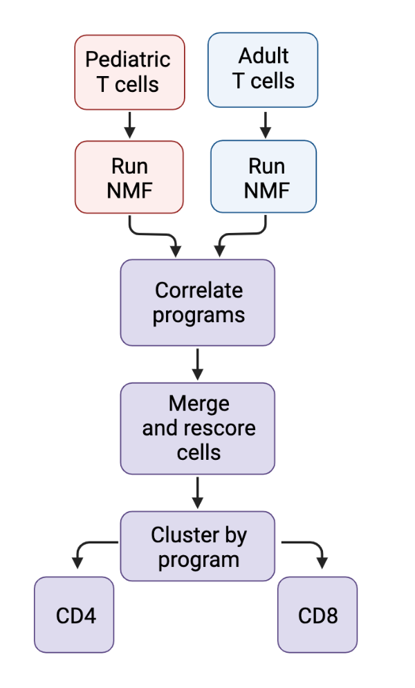

## T cell analysis

All Tcell analysis (NMF, comparing programs, detailed annotation based on program) is run here:

1. [Run NMF for pediatric and published adult T cells](#1--Run-NMF)
2. [Correlate pediatric and adult programs identified](#2--Correlate-pediatric-and-adult-programs)
3. [Identify CD4 and CD8 T cells](#3--Identify-CD4-and-CD8-T-cells)
4. [Visualize final programs](#4--Visualize-final-programs)
5. [Compare to published melanoma and NSCLC-associated T cells](#5--Compare-to-published-melanoma-and-NSCLC-associated-T-cells)
6. [Run Trajectory analysis](#6--Run-Trajectory-analysis)
7. [Clonal analysis](#7--Clonal-analysis)

  

This includes pediatric Tcells, adult Tcells, and comparisons between the two. It does NOT include basic visualizations (UMAP with annotations, etc) or any analyses that also use myeloid cells. 

### 1- Run NMF:

In ***01a_Ped/NMF*** and ***01b_Adult/NMF***:
	- Run de novo NMF on all Tcells separately for pediatric (***01a_Ped/NMF***) and adult (***01b_Adult/NMF***) T cells. 
	- Actual NMF is run on O2 HPC server, results saved here and all follow up analysis beyond just running NMF is done locally.

### 2- Correlate pediatric and adult programs:
In ***02_Ped.Adult/01_compare_NMF***: 

-***deNovoPedTcell.v.deNovoAdultTcell.Rmd:*** Compare the programs identified in ped/adult- shared programs? specific programs?  Also compare to original NMF programs generated by CD4/CD8 ped separately (01a_Ped/NMF/ARCHIVE/) to help with initial annotate. These CD4/CD8 derived programs are NOT used elsewhere downstream. 
	
-***deNovoPedTcell.v.deNovoAdultTcell_identifyNewMarkers.Rmd:*** Generate new marker genes are generated for the “shared” programs using the following approach:
	1) Merge “shared” program gene lists, either by union or intersection. For now, using union, but this may change
	2) Score all ped/adult cells for these “merged” shared gene lists + gene lists specific to ped/adult (tree, stress, cyto Cd8.
	3) Assign each cell to max scoring program
	3) Using seurat’s FindAllMarkers, find new markers for all (shared and specific) programs based on these assignments
	4) Filter by padj/logFC. Will only use top 100 downstream.

### 3- Identify CD4 and CD8 T cells:
In ***02_Ped.Adult/02_detailed_annot***:
	- Using new program assignments, split seurat object by program (***IdentifyCD4.CD8_byNMF.Rmd***) Run cluster-wise CD4/CD8 annotation (just based on marker genes). 
	- Some programs require sub-clustering + cell-wise annotations. Altogether, 17 cells (out of both ped/adult) could not be annotated. 
	- Split seurat into cd4/cd8, re-run clustering/harmony integration.

### 4- Visualize final programs:
In ***02_Ped.Adult/03_Visualize.Reannotate_programs***: 
	- Visualize cd4/cd8 by updated NMF programs (***01_Visualize.Reannotate_programs.Rmd***). Compare ped/adult proportions, re-annotate as needed (named based on correlation with CD4/CD8 ped programs originally; i.e., “CD4_Inhibitory”) based on GO terms, marker gene expression, etc. Update seurat objects/marker lists to reflect this re-annotation

In ***02a_NMF_plots.Rmd***, make heat maps,UMAP, density, bar plots, etc for CD4/CD8/All Tcells for ped/adult together, using the updated annotations from ***01_Visualize.Reannotate_programs.Rmd***

In ***02b_VisualizeProgramsIndividually.Rmd***, use seurat object split by program + split by CD4/CD8, then do various visualizations to look for patterns WITHIN programs. Also try combinations of programs (ex, Cytoxtoxic/dysfunctional) to look for additional trends

### 5- Compare to published melanoma and NSCLC associated T cells:
In ***02_Ped.Adult/04b_ComparisonToOtherTumor***:
	- Preprocess published melanoma and NSCLC CD8 T cells: identify T cells and CD8 as needed (***Preprocess_melanoma/NSCLC.Rmd***)
	- Merge with our pediatric glioma T cells + adult glioma T cells: ***Merge_melanoma.NSCLC.glioma_compare*.Rmd***
	- Run STREAM trajectory analysis (***04a_Trajectory***)
	
### 6- Run Trajectory analysis:
In ***02_Ped.Adult/04a_Trajectory***:
	- Run Slingshot trajectory analysis- various combinations of programs (*Not used downstream*). ***Slingshot.Rmd***
	- Run Monocle (*Not used downstream*). ***Monocle.Rmd***
	- Run STREAM trajectory comparing glioma, NSCLC, and melanoma CD8 Tcells (*This approach used downstream*). ***01_STREAM_preprocess.Rmd***, ***02_Process_ref_for_STREAM.ipynb***, and ***03_Map_onto_ref_STREAM.ipynb***

### 7- Clonal analysis:
In ***01a_Ped/02_ClonalOverexpression*** and ***01b_Adult/02_ClonalOverexpression***, run clonal vs monoclonal analysis as in Cell 2021 to identify genes over expressed in clonal cells. Run separately for adult/ped. Actual analysis is run on O2 due to time/memory constraints. NOTE: this analysis is run AFTER NMF and AFTER identifying CD4/CD8 cells in program-wise basis for Adult/Ped t cells together. Thus, the adult results may vary slightly from Cell 2021 paper, as our CD4/CD8 annotations are not identical

	

*Additional files*:
***02a_Tcells/01a_Ped/NMF/NMF_DoubleID.Rmd***: Run NMF on all ped Tcells, use for identifying any potential doublets (based on Cell 2021 methods), but also used to identify myeloid cells annotated as Tcells based on cluster-wise annotation. Before this re-annotation, use seurat object called “tcell_seurart_preReannotation”, after re-annotation just “tcell_seurat.Rmd”
