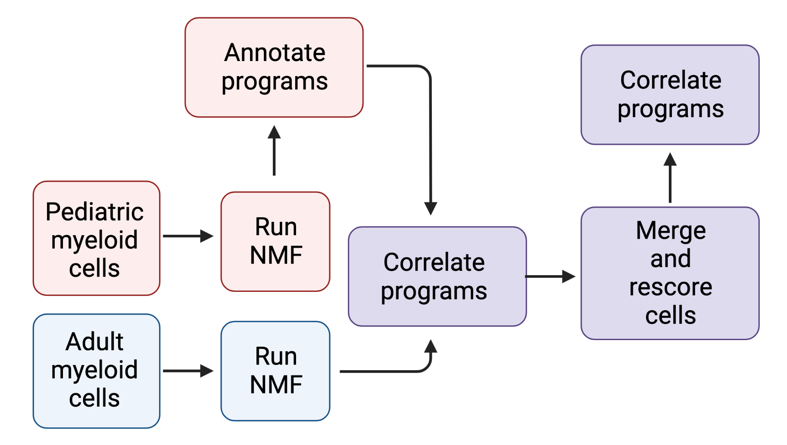

## Analysis of myeloid scRNAseq

Overall approach:
1) [De novo NMF for pediatric myeloid cells](#NMF) 
2) [Correlate with adult GBM 10X to help annotate](#2.-Use-published-10x-glioma-associated-myeloid-scRNAseq-data-as-reference-to-help-annotate)
3) [Identify higher-level cell types (macrophage/microglia) across programs](#3. Additional layers of annotation *(/02_AdditionalAnnotation/)*)
4) [Compare programs (+ cells types) to adult myeloid cells (SmartSeq2 IDHmut/GBM datasets)](#4. Adult/pediatric comparison: */03_CompareToAdult/*) 

  

### NMF ###
 
***01a_NMF/***
- Ran NMF locally for myeloid cells, as well as with Cycling set as separate program (this option not used downstream)- ***01a_NMF*.Rmd***
- programs plotted in ***NMF_plots.Rmd*** (heat maps, UMAP, etc)
-Tested different numbers of repeats (10/30/50) in ***NMF_10vs30vs50_repeats.Rmd***. For myeloid cells at least (nothing else tested), there was no real difference between number of repeats, so 10x used downstream.

***01b_Ped.Adult.NMF/***
- Run de novo NMF on adult myeloid cells (smartseq2, idhmut, gbm) in ***01a_AdultCohorts_DeNovoNMF.Rmd***. Two main options here- separately for IDHmut/GBM, or merged for IDHmut/GBM. Tried to assess which makes more sense (which represents cluster split better, etc) and decided to use the merged option (i.e., merging idhmut/gbm adult myeloid count matrix —> running NMF) moving forward.
- Run de novo NMF on merged ped/adult myeloid count matrix in ***01b_Ped.Adult_merged_NMF.Rmd***. Then correlate with adult 10X GBM to help annotate (***02_AdultGBM10X_AnnotatePed.Adult.Rmd***) This option not used downstream- decided that running separately for ped/adult then correlating made more sense.

***01c_Liger/***
	Run integrative NMF (liger) on pediatric myeloid cells. correlate with NMF programs. Main purpose here is to help inform the number of programs to use.

### 2. Use published 10x glioma-associated myeloid scRNAseq data as reference to help annotate

- Correlate ped programs with adult gbm 10x to help annotate. Correlated with both primary and recurrent tumors from adult GBM 10X dataset, but recurrent used downstream. ***01a/NMF/02b_AdultGBM10X_AnnotatePed*.Rmd***

### 3. Additional layers of annotation *(/02_AdditionalAnnotation/)*

- No ordering to these Rmd files, none depend on others
- Used for additional levels of annotation (primarily microglia/macropahge) on top of programs. Also compare programs to these cell types to help annotate programs- some are exclusively microglia/macrophage, others are a mix
	
***Microglia.vs.Macrophage.Rmd***
		Used microglia/macrophage geneses from Li- scored ped myeloid, various visualizations. Compare to myeloid NMF programs

***MgTAM.vs.MoTAM.Rmd***
		Similar to microglia vs macrophage, but using geneses from Adult GBM 10X paper (supplemental table comparing mgTAM vs MoTAM)

***AdultGBM10X_Mo.Mg.Mono.Prol_AnnotatePed.Rmd***
		Similar to above, but using geneses from adult GBM 10X paper- generated by me. Set all cells as either mgTAM, moTAM, cycling, monocytes, then use Seurat's FindAllMarkers. These markers generated in ***01_Preprocessing/03_PreprocessAdultDatasets*** and used here.
		
***AdultGBM10X_Mo.Mg.Mono_AnnotatePed.Rmd***
		Similar to above, but with prol_TAMs excluded

***Artifact_Stevens2020.Rmd***
		Stevens et al 2020 described artifact in myeloid cells generated by enzymatic dissociation. Used this geneset here, scored myeloid cells, compared to programs- are any of our programs potentially artifacts? Stress_Response shows correlation, but weaker than in paper- may just be microglia

***FunctionalMyeloidMarkers_FromLi.Rmd***
		Li sent markers from a paper that described functional states in myeloid cells. Scored these here, compared to myeloid programs. No clear correlation, not used downstream
	
	
## 4. Adult/pediatric comparison: */03_CompareToAdult/*
Overall goal of analyses in this folder are to compare the proportion of programs and cell types in adult vs ped myeloid cells

***01_Merge_AssessIntegration.Rmd***: merge ped/adult myeloid cells into single object for later use. Compare integration of ped/adult on UMAP. This helped to determine that ped/adult don’t form distinct clusters, and that, in general, we expect PROPORTIONS of cell states to vary, but not necessarily cell states themselves. 
	
***02a_CompareProgramProportions_PedNMF.Rmd***: The simplest way of comparing cell states. Score ped/adult for ped programs (generated in ***01a_NMF/NMF.Rmd*** and annotated in ***01a_NMF/02a_AdultGBM10X_AnnotatePed_Recurrent.Rmd***), then compare breakdown of these programs. Because adult cells score quite lowly for these ped programs, determined that this was not most appropriate route- need to generate programs that are more representative of both ped and adult myeloid cells.

***02b_CompareProgramProportions_CorrelateAdult.Ped.NMF.Rmd***: One approach for generating programs that are more representative of both ped and adult myeloid cells- run NMF separately on ped/adult (***NMF/Adult/Myeloid/AdultCohorts_DeNovoNMF.Rmd***) myeloid cells, then use this to determine shared/specific programs. *This approach used downstream*

***02c_CompareProgramProportions_MergedAdult.PedNMF.Rmd***: Another approach for generating programs that are more representative of both ped and adult myeloid cells- run NMF on ped/adult myeloid cell simultaneously (***NMF/Adult/Myeloid/Ped.Adult_merged_NMF.Rmd***), then use these programs to score myeloid cells and compare proportions. Drawback: not as direct of a comparison, and also is a different approach than that used for T cells. *This approach not used downstream*

***03_Macrophage.Microglia_CompareProportions***
	Compare proportion of macrophage/microglia in ped vs adult (based on marker gene expression)
